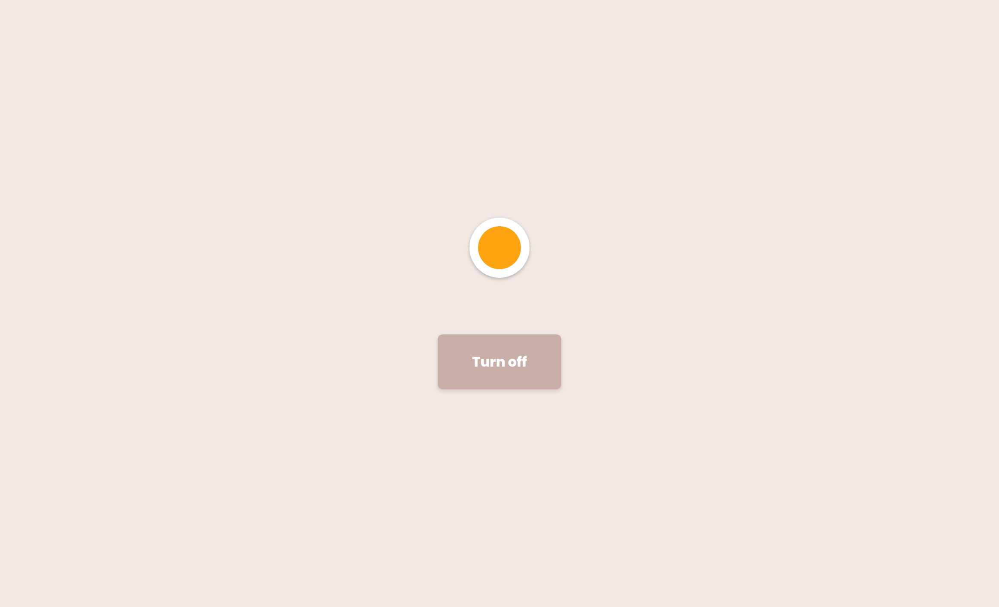
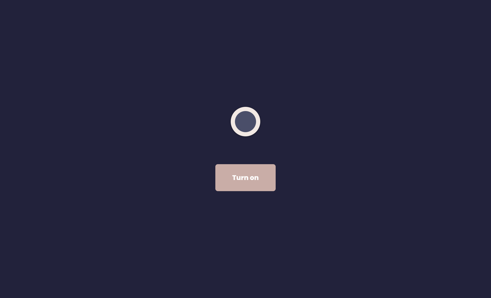
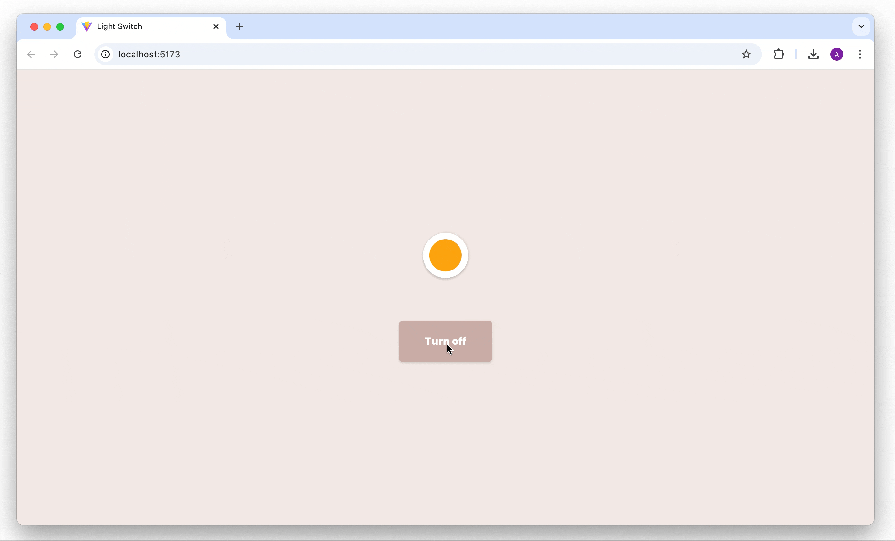

# 💡 Light Switch App – NOVI Frontend Module

This repository contains my solution for the Light Switch App exercise from the Frontend Development module at [Novi University](https://www.novi.nl).
The goal of this assignment is to practice working with **React State** and **conditional rendering** by building a simple interactive application that toggles a light on and off. 

The app demonstrates how to store and update state, apply conditional CSS styling, and dynamically change button text based on the current state.

## Table of Contents

- [Tech Stack](#tech-stack)
- [Key Features](#key-features)
- [Preview](#preview)
- [Project Setup](#project-setup)
- [Credits](#credits)
- [License](#license)

---

## Tech Stack

- **React** (v18.2.0)
- **Vite**
- **HTML5**
- **CSS3**
- **JavaScript ES6+**
- **Node.js** & **NPM**

---

## Key Features

- State management with React `useState` to store the light's status (on/off). 
- Button click handler toggling the light between on (`true`) and off (`false`). 
- Conditional styling:
  - Class `on` applied when the light is turned on. 
  - Class `off` applied when the light is turned off.
- Dynamic button text:
  - Displays **"Turn off"** if the light is on. 
  - Displays **"Turn on"** if the light is off.
- Real-time console logging to track state changes while interacting with the button.

---

## Preview

<details>
<summary><strong> Light Switch on </strong></summary>



</details>

<details>
<summary><strong> Light Switch off </strong></summary>



</details>



> A minimal light switch interface where the background and button text change dynamically based on the current state.

---

## Project Setup

1. Clone or open the repository in an IDE

2. Install dependencies
   ```bash
   npm install
   ```
3. Start the development server
   ```bash
   npm run dev
   ```
4. Open your browser at http://localhost:5173 to view the app.


## Credits

> This assignment, visual designs and base project setup were created and provided by **Novi University** as part of the Frontend module.

---

## License

> "This project is for **educational purposes only**. All images, designs, and dummy content are to be used for learning and non-commercial use."

---